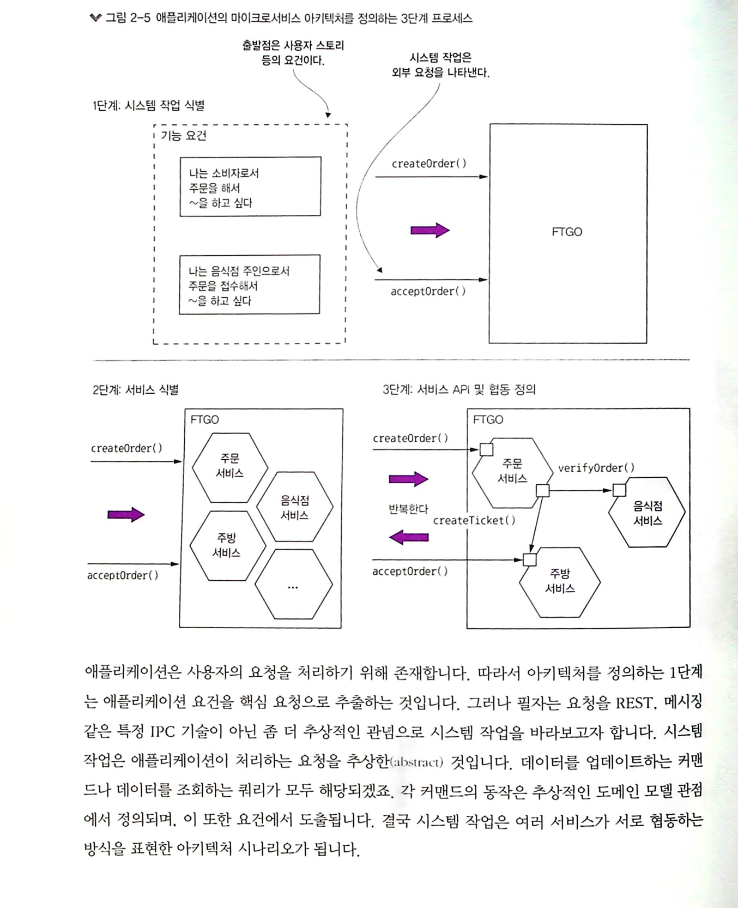

MSA (Micro service architecture)
----------------------

 > #### 모놀리식 아키텍처  
 > 실행/배포 가능한 단일 컴포넌트로 구성된 애플리케이션 패턴

 > #### 마이크로서비스 아키텍처  
 >느슨하게 결합된, 독립적으로 배포 가능한 여러 서비스로 구성된 애플리케이션 패턴

서비스, 캡슐화, 

느슨한 결합 - 유지보수, 테스트, 배포 등 개발 단계의 품질 속성 개선됨

도메인 주도 설계 주요  
  
SRP, CCP  
  
마이크로서비스 아키텍처 IPC  
 텍스트 메시지 포맷 - JSON, XML  
 이진 메시지 포맷 - 프로토콜 버퍼,  
  
 REST - HTTP  
 REST 성숙도 모델  
  레벨 0 ~ 3  
  HATEOAS를 활용  
 REST 는 IDLE 로 정의  
 